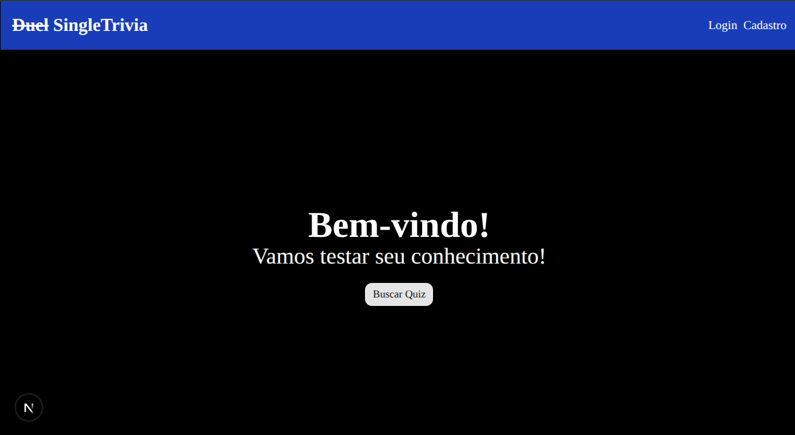
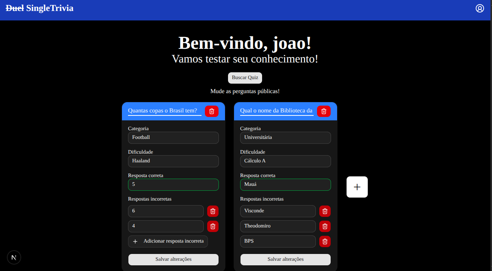
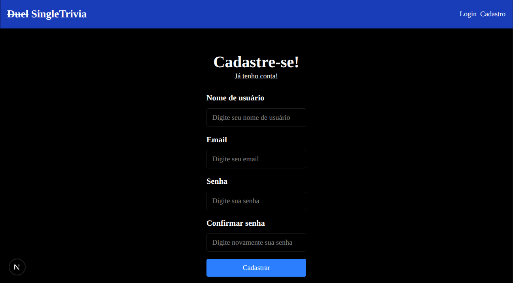
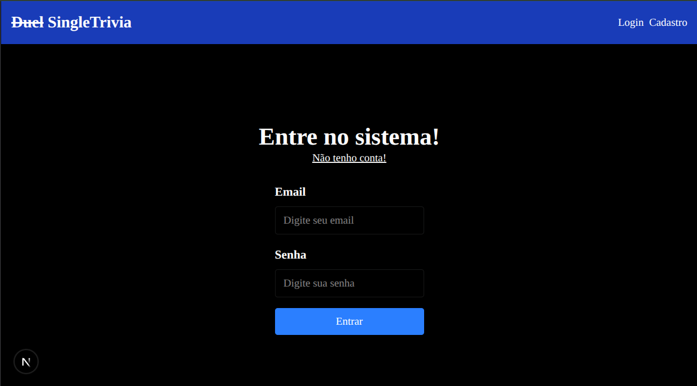

# dueltrivia-frontend

Aplicação web (Next.js) para **jogar um quiz de perguntas (Trivia)** e também **criar/editar/excluir perguntas públicas** associadas ao usuário logado. <br> Integrantes: 
- [**Lucas Melo**](https://github.com/meloluvert/dueltrivia-frontend)
- [**Caio Lene**](https://github.com/CaioLCM/duelTrivia-backend)

## Como executar

1. Instale dependências:
   - `npm install`
2. Configure a variável de ambiente:
   - `NEXT_PUBLIC_API_URL` (URL base do backend)
   - https://dueltrivia-backend-production.up.railway.app/docs
3. Inicie o dev server:
   - `npm run dev`

## Telas
Home (sem usuário) <br>


Home (com usuário) <br>


Cadastro <br>


Login <br>


## Stack

- **Next.js** (App Router)
- **React**
- **TypeScript**
- **Tailwind CSS**
- **shadcn/ui** (componentes UI)
- **Axios** (integração com API)
- **sonner** (toasts)
- **lucide-react** (ícones)

Dependências principais que usei:
- `next`
- `axios`
- `tailwindcss`
- `shadcn`
- `sonner`
- `lucide-react`


## Integração com API (Axios)

Arquivo: **`lib/api.ts`**

- Cria um cliente Axios:
  - `baseURL: process.env.NEXT_PUBLIC_API_URL`
- Interceptor de requests:
  - quando roda no browser (`typeof window !== "undefined"`), tenta pegar o token em `localStorage` (`@token-trivia`)
  - se existir, injeta `Authorization`.

Endpoints usados no frontend:
- `GET /trivia` → `getTriviaQuestions()`
- `GET /questions` → `getUsersQuestions()`
- `POST /questions` → `createQuestion()`
- `PUT /questions/:id` → `updateQuestion()`
- `DELETE /questions/:id` → `deleteQuestion()`


## Organização de Pastas

```text
.
├── app/
│   ├── layout.tsx              # Layout global da aplicação
│   ├── page.tsx                # Página inicial (Home) e gerenciamento do quiz
│   ├── login/
│   │   └── page.tsx            # Tela de login
│   └── cadastro/
│       └── page.tsx            # Tela de cadastro
│
├── components/
│   ├── DialogQuiz.tsx          # Modal de execução do quiz
│   ├── QuestionCard.tsx        # Card para criar, editar e excluir perguntas
│   ├── layout/
│   │   └── Header.tsx          # Cabeçalho da aplicação
│   └── ui/                     # Componentes baseados em shadcn/ui
│       ├── button.tsx
│       ├── card.tsx
│       ├── dialog.tsx
│       ├── input.tsx
│       └── ...
│
├── contexts/
│   └── AuthContext.tsx         # Contexto de autenticação
│
├── lib/
│   ├── api.ts                  # Cliente Axios e interceptador de autenticação
│   └── utils.ts                # Utilitário cn() para classes Tailwind
│
└── types/
    ├── auth.ts                 # Tipos de autenticação e usuário
    └── question.ts             # Tipos das perguntas e respostas da API
```


## Lógica do aplicativo

### Fluxo geral
1. **Auth** gerencia sessão do usuário via token.
2. Ao entrar na **Home** (`app/page.tsx`):
   - Se **não estiver logado**, exibe **botões** para navegar para `/login` ou `/cadastro`.
   - Se **estiver logado**, permite **buscar/gerenciar perguntas** e iniciar o quiz.

### Home (`app/page.tsx`)
- Mantém estado:
  - `questions`: lista de perguntas do quiz atual.
  - `userQuestions`: perguntas públicas gerenciadas pelo usuário.
  - `openQuiz`: controla abertura do `DialogQuiz`.
  - `openRegister`: modal informativo quando usuário não está logado.
- Efeito (`useEffect`):
  - Quando `user` existe, chama `getUsersQuestions()` e preenche `userQuestions`.
- Iniciar quiz (`handleStartQuiz`):
  - Busca questões trivia públicas (`getTriviaQuestions()`).
  - Busca também as questões do usuário (`getUsersQuestions()`).
  - Se o usuário tiver perguntas cadastradas:
    - seleciona **1 pergunta aleatória** do conjunto do usuário
    - remove/insere no array de trivia (`data.pop()` + `data.push(randomQuestion)`)
    - embaralha com `sort(() => Math.random() - 0.5)`
  - Abre o modal `DialogQuiz`.

### Quiz modal (`components/DialogQuiz.tsx`)
- Recebe:
  - `questions`: lista de perguntas do quiz.
  - `open`: se o modal está aberto.
  - `onOpenChange`: callback de controle.
- Dentro do modal:
  - `perguntasAleatorias`: embaralha o conjunto recebido.
  - `mapaOpcoes`: monta as opções combinando `correct_answer` + `incorrect_answers` e embaralha.
  - Navegação:
    - `atual` controla qual pergunta está em exibição.
    - botões **Anterior/Próximo** alteram `atual`.
  - Seleção/marcação:
    - `handleSelecionar(opcao)`: registra a resposta selecionada para a pergunta atual.
    - `handleMarcar()`: marca a resposta escolhida como “final” para aquela questão (desabilita o botão selecionado depois).
  - Pontuação:
    - `handleEnviar()` calcula acertos comparando `respostas[index].resposta` com `pergunta.correct_answer`.
    - Exibe texto com quantidade de acertos e porcentagem.

### CRUD de perguntas (`components/QuestionCard.tsx`)
- Recebe:
  - `question`: a pergunta atual (pode ser uma “nova” sem `id`).
  - `onDelete`: callback quando excluir.
  - `onCreated`: callback para substituir a pergunta antiga pela recém-criada (principalmente quando `id` muda).
- Estado do formulário:
  - `form`: copia `question` para campos editáveis.
  - `loading`, `errors`, `openDelete`.
- Validação (`validar()`): garante preenchimento de:
  - `statement`, `category`, `difficulty`, `correct_answer`
  - e pelo menos **1** resposta incorreta.
- Salvar (`handleSave`):
  - Se `form.id` existe → chama `updateQuestion(form.id, form)`.
  - Caso contrário → chama `createQuestion(form)` e atualiza o estado com a pergunta retornada.
- Excluir (`handleDelete`):
  - Se `form.id` existe → chama `deleteQuestion(form.id)`.
  - Em seguida chama `onDelete(form)` para atualizar a lista no componente pai.


## Auth Context (assinatura e comportamento)

Arquivo: **`contexts/AuthContext.tsx`**

O contexto provê estado e funções para manipular autenticação:

### Tipos (referência)
Em **`types/auth.ts`**:

- `IAuthContext`:
  - `user: IUser | null`
  - `token: string | null`
  - `loading: boolean`
  - `authenticated: boolean`
  - funções assíncronas:
    - `signIn(data: ILoginRequest): Promise<void>`
    - `signUp(data: IRegisterRequest): Promise<void>`
    - `signOut(): Promise<void>`
    - `getUser(): Promise<void>`
    - `updateUser(data: Partial<IRegisterRequest>): Promise<void>`
    - `deleteUser(): Promise<void>`
    - `sendResult(result: "win" | "lose" | "draw"): Promise<void>`

### Implementação (assinatura das funções)
No `AuthContext.tsx`, o provider expõe:

- **`signIn(data: ILoginRequest): Promise<void>`**
  - `POST /users/login`
  - salva token em `localStorage` com chave **`@token-trivia`**
  - injeta `Authorization: Bearer <token>` no Axios
  - chama `getUser()` para carregar `user`

- **`signUp(data: IRegisterRequest): Promise<void>`**
  - `POST /users`
  - salva token e atualiza `user`

- **`getUser(): Promise<void>`**
  - `GET /users`
  - define `user` a partir de `response.data.user`

- **`updateUser(data: Partial<IRegisterRequest>): Promise<void>`**
  - `PUT /users`
  - atualiza `user` com o retorno

- **`sendResult(result: "win" | "lose" | "draw"): Promise<void>`**
  - `PATCH /users/result`
  - envia resultado para o backend

- **`deleteUser(): Promise<void>`**
  - `DELETE /users`
  - chama `signOut()` ao finalizar

- **`signOut(): Promise<void>`**
  - remove token do `localStorage`
  - remove header `Authorization` do Axios
  - zera `user` e `token`

### Persistência de sessão
- No `useEffect` inicial do `AuthProvider`, chama `loadStorage()`:
  - lê `@token-trivia`
  - se existir:
    - injeta o token no Axios
    - chama `GET /users` para buscar `user`
  - controla `loading` até completar.

### Hook de acesso
- Exporta `useAuth()` para consumo do contexto em componentes/client pages.

